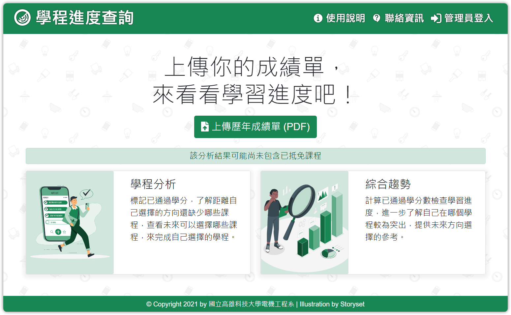

# 學生學程查詢系統



## Overview

學生學程查詢系統透過分析學生成績單，來了解學生的學習進度，提供未來選擇方向的參考。

## Docker (Production)

### Configuration

- 配置環境變數，編輯檔案 `./docker/config.env`。

    ```text
    mysql_user=<db-user>
    mysql_password=<db-password>
    mysql_host=<db-host>
    SECRET_KEY=<secret-key>
    MYSQL_ROOT_PASSWORD=<db-password>
    ```

  - db-user : 資料庫的帳號
  - db-password : 資料庫的密碼
  - db-host : 資料庫的地址
  - secret-key : flask session 的金鑰

- 配置 SSL 證書在 Nginx Server，編輯資料夾 `./docker/nginx/` 中的 `certificate.crt` 與 `private.key`。

- 修改 Flask Server 為 Production 模式，編輯 `./main.py`。

    ```python
    # mode = 'development'
    mode = 'production'
    ```

### Startup

使用 Docker 建立容器啟動系統。

```bash
docker-compose up -d
```

預設將啟動以下連接埠 :

- `20010` : HTTP ( 將自動跳轉到 HTTPS )
- `20011` : HTTPS

## Project Structure

```text
.
├── app
│   ├── config ( App 配置 )
│   │   ├── base.py ( 專案 )
│   │   ├── flask.py ( Flask )
│   │   └── mysql.py ( Mysql )
│   ├── logs ( 日誌 )
│   │   └── flask.log
│   ├── model ( 模型 )
│   │   ├── analyse.py ( 成績單分析 )
│   │   ├── certificate.py ( PDF 證書製作 )
│   │   ├── database.py ( 資料庫 )
│   │   ├── jinja.py ( 自訂模板 )
│   │   ├── passed_course.py ( 抵免成績 )
│   │   ├── transcript.py ( 成績單 )
│   │   └── user.py ( 使用者 )
│   ├── passed.csv ( 抵免清單 )
│   ├── static ( 靜態資源 )
│   │   ├── node_modules ( npm 資源 )
│   │   │   └── ...
│   │   ├── package.json ( npm 套件清單 )
│   │   └── src ( 原始資源 )
│   │       ├── file ( 檔案資源)
│   │       │   └── ...
│   │       ├── img ( 圖片資源 )
│   │       │   └── ...
│   │       ├── js ( Javascript 資源)
│   │       │   ├── base.js ( 基底 )
│   │       │   ├── index.js ( 首頁 )
│   │       │   └── result.js ( 分析結果 )
│   │       ├── scss ( CSS 資源 )
│   │       │   ├── all.scss ( 總輸出 )
│   │       │   ├── base ( 基底類別 )
│   │       │   ├── components ( 元件類別 )
│   │       │   ├── helpers ( 引用覆蓋類別 )
│   │       │   ├── layout ( 布局專用類別)
│   │       │   ├── pages ( 頁面專用類別)
│   │       │   └── utilities ( 實用類別 )
│   │       └── video ( 影片資源 )
│   │           └── ...
│   ├── templates ( HTML 模板 )
│   │   ├── 404.html ( 404 頁面 )
│   │   ├── base ( 基底 )
│   │   │   └── all.html
│   │   └── root ( 基於網站根目錄 )
│   │       ├── index.html ( 首頁 )
│   │       ├── passed-table.html ( 抵免頁面 )
│   │       └── result.html ( 分析結果頁面 )
│   ├── __init__.py ( flask 建立 )
│   └── view ( 路由控制 )
│       └── root ( 基於網站根目錄 )
│           ├── __init__.py ( 一般使用者 )
│           ├── user.py ( 使用者管理 )
│           └── manager.py ( 管理員使用者 )
├── docker ( docker 使用資源 )
│   ├── config.env ( 環境變數 )
│   ├── mariadb ( 資料庫 )
│   │   ├── data.sql ( 資料 )
│   │   ├── ddl.sql ( 結構 )
│   │   └── mariadb.cnf ( 資料庫配置 )
│   └── nginx ( 網頁伺服器)
│       ├── certificate.crt (HTTPS 證書)
│       ├── default.conf ( Nginx 配置 )
│       ├── private.key ( HTTPS 金鑰)
│       └── ssl.conf ( Nginx SSL 配置)
├── docker-compose.yml
├── main.py ( 主要程式進入點 )
└── requirements.txt ( python 套件清單 )
```
